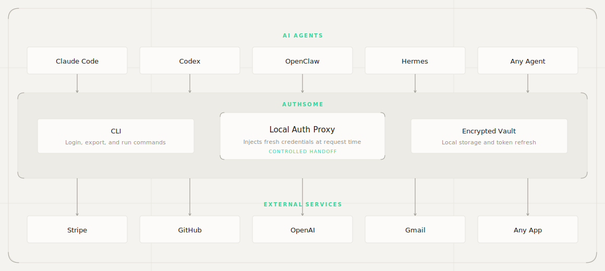

<p align="center">
  <picture>
    <source media="(prefers-color-scheme: dark)" srcset="assets/authsome-logo-dark.svg">
    <source media="(prefers-color-scheme: light)" srcset="assets/authsome-logo-light.svg">
    
  </picture>
</p>

<p align="center">
  <a href="https://pypi.org/project/authsome/"></a>
  <a href="https://pypi.org/project/authsome/"></a>
  <a href="https://opensource.org/licenses/MIT"></a>
  <a href="https://pypi.org/project/authsome/"></a>
  <a href="https://github.com/agentrhq/authsome/actions/workflows/test.yml"></a>
  <a href="https://codecov.io/gh/agentrhq/authsome"></a>
  <a href="https://discord.gg/9YP2C9tvMp"></a>
</p>

<p align="center">
  <b>Local-first credential broker and vault for AI Agents</b>
</p>

<p align="center">
  <a href="https://authsome.ai/docs">Docs</a> ·
  <a href="https://authsome.ai">Website</a> ·
  <a href="https://discord.gg/9YP2C9tvMp">Discord</a> ·
  <a href="https://github.com/agentrhq/authsome/issues">Issues</a>
</p>

---

An open-source credential broker that sits between your agents and the services they call. Instead of sharing credentials with every agent, log in once via OAuth2 or API keys. Authsome stores credentials securely and injects them via an HTTP proxy. You get one place to manage access, rotate keys, and see what every agent is doing.

**45 bundled providers** out of the box: 14 OAuth2 and 31 API key. [See the full list](https://authsome.ai/docs/reference/bundled-providers).

---

## Demo

https://github.com/user-attachments/assets/27f9b229-baf4-4889-be9a-378a133654dc

---

## Why Agents Need Authsome

Agents run beyond interactive sessions. They live in CI, over SSH, in cron jobs, in background workers, and in parallel pipelines. They need API access that survives without a human in the loop.

Hardcoded environment tokens leak or go stale, and building auth flow logic, token storage, refresh handling, and per-provider config into every project rebuilds the same plumbing every time.

Authsome is the local credential layer agents call at runtime.

- **No credential sprawl.** One encrypted store. Every provider, every agent, one place.
- **No SaaS, no privacy trade-off.** Credentials never leave your machine. Eliminates credential exfiltration risks as agents never see them.
- **No browser required at runtime.** Setup can use browser PKCE, device code, or a browser bridge for secure API key entry. After that, agents run headlessly.

---

## How It Works

The CLI is the agent's interface: setup once, then inject fresh credentials whenever a tool runs.

<picture>
  <source media="(prefers-color-scheme: dark)" srcset="assets/authsome-how-it-works-dark.svg">
  <source media="(prefers-color-scheme: light)" srcset="assets/authsome-how-it-works-light.svg">
  
</picture>

Authenticate once:

```bash
authsome login github
# This opens a browser on user's machine; user completes login without sharing the creds with the agent.
```

Then agents get valid credentials on demand when they try to access external services.
All they need to do is use `authsome run --` before the command they want to run:

```bash
authsome run -- curl -s "https://api.github.com/user/repos?per_page=10"
# runs behind a local auth proxy that injects headers at request time
# without exposing secrets in the child process environment.
# matched automatically via provider api_url (e.g. api.openai.com)
```

Credentials are stored locally, encrypted at rest, and refreshed before expiry. No server. No account. No cloud.

---

## Why Authsome

| | authsome | Hardcoded env tokens | DIY |
|--|:--------:|:--------------------:|:---:|
| Automatic token refresh | ✅ | ❌ | build it |
| OAuth2 + API keys | ✅ | ❌ | build it |
| Runtime headless use | ✅ | ✅ | varies |
| Local, no SaaS dependency | ✅ | ✅ | ✅ |
| Built-in providers, zero config | ✅ | ❌ | ❌ |
| Multi-account per provider | ✅ | ❌ | build it |

Authsome gives agents one command for a valid token, without scattering long-lived secrets across every project.

---

## Install

Requires Python 3.13+.

```bash
uv tool install authsome
```

## Quick Start

> If you find this useful, please [star the repo on GitHub](https://github.com/agentrhq/authsome) — it helps a lot!

Add the authsome skill to your agent (claude, codex, cursor, hermes, etc.):

```bash
npx skills add agentrhq/authsome
```

And try a sample task that requires access to external services:

> Star the repo agentrhq/authsome

The agent will use authsome to star the repo on github.

## Agent Integrations

Authsome ships with adapters for the most common agent frameworks and CLIs:

- [Claude Code](https://authsome.ai/docs/integrations/agents/claude-code)
- [Codex](https://authsome.ai/docs/integrations/agents/codex)
- [Cursor](https://authsome.ai/docs/integrations/agents/cursor)
- [OpenCode](https://authsome.ai/docs/integrations/agents/opencode)
- [LangChain](https://authsome.ai/docs/integrations/agents/langchain)
- [LlamaIndex](https://authsome.ai/docs/integrations/agents/llamaindex)
- [OpenAI Agents SDK](https://authsome.ai/docs/integrations/agents/openai-agents-sdk)
- [Anthropic SDK](https://authsome.ai/docs/integrations/agents/anthropic-sdk)

Full list at [authsome.ai/docs/integrations](https://authsome.ai/docs/integrations/agents/index).

## Docs

Full documentation lives at **[authsome.ai/docs](https://authsome.ai/docs)**.

- [Quickstart](https://authsome.ai/docs/quickstart)
- [CLI reference](https://authsome.ai/docs/reference/cli)
- [Architecture](https://authsome.ai/docs/concepts/architecture)
- [Custom providers](https://authsome.ai/docs/guides/custom-providers)
- [Troubleshooting](https://authsome.ai/docs/troubleshooting/doctor)

To preview the docs site locally:

```bash
cd docs/site
npm i -g mint   # requires Node.js >= 20.17.0
mint dev
```

## Community

- **[Discord](https://discord.gg/9YP2C9tvMp)** for questions, help, and showing what you're building.
- **[GitHub Issues](https://github.com/agentrhq/authsome/issues)** for bugs and feature requests.

## Security

Authsome is a credential tool. If you find a vulnerability, please do **not** open a public GitHub issue.

See the [responsible disclosure policy](https://authsome.ai/docs/security/disclosure) for how to report it privately.

## Roadmap

See [authsome.ai/docs/roadmap](https://authsome.ai/docs/roadmap) for what's shipped, what's next, and what's out of scope.

## Contributing

- **Found a bug?** [Open an issue](https://github.com/agentrhq/authsome/issues/new?template=bug_report.md)
- **Have an idea?** [Start a discussion](https://github.com/agentrhq/authsome/discussions/new?category=ideas)
- **Want to contribute?** Read [CONTRIBUTING.md](CONTRIBUTING.md) for development setup, testing, and the engineering principles we follow.

## Links

- **Website:** [authsome.ai](https://authsome.ai)
- **Docs:** [authsome.ai/docs](https://authsome.ai/docs)
- **Discord:** [discord.gg/9YP2C9tvMp](https://discord.gg/9YP2C9tvMp)
- **Issues:** [github.com/agentrhq/authsome/issues](https://github.com/agentrhq/authsome/issues)

## Star History

<a href="https://star-history.com/#agentrhq/authsome&Date">
  <picture>
    <source media="(prefers-color-scheme: dark)" srcset="https://api.star-history.com/svg?repos=agentrhq/authsome&type=Date&theme=dark">
    <source media="(prefers-color-scheme: light)" srcset="https://api.star-history.com/svg?repos=agentrhq/authsome&type=Date">
    
  </picture>
</a>

## License

MIT. See [LICENSE](LICENSE).
